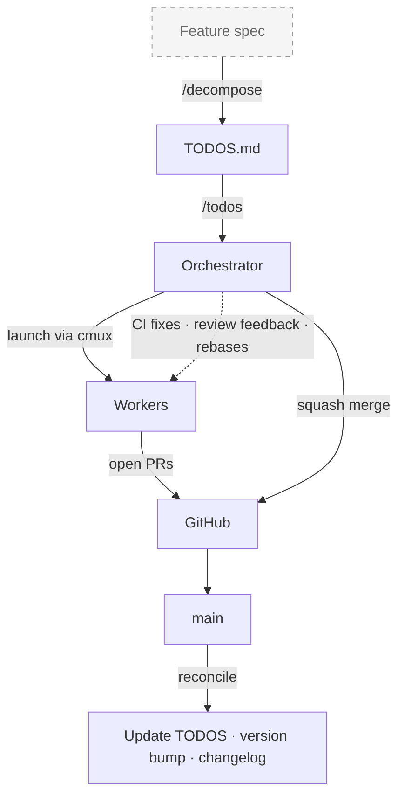

# workflow-kit

Workflow orchestration for AI coding tools. Not a framework, not a harness -- bring your own AI tool, your own coding conventions, your own feature specs. workflow-kit handles what comes next: decomposing work into human-reviewable PRs, running parallel AI sessions to implement them, and delivering reviewed code ready to merge.

Each TODO gets its own full interactive session -- not a sub-task or function call, but a complete session with its own context window, tool access, and the full capabilities of whichever harness you use. You can switch into any worker to steer it, give feedback, or iterate on a PR, while the orchestrator manages the pipeline around them.



- **Bring your own spec** -- PRD, design doc, verbal description, whatever. `/decompose` breaks it into PR-sized TODO items with dependency ordering
- **Merge strategies** -- merge after approval + CI passes, auto-merge as soon as CI passes, or confirm each merge manually
- **WIP limits** -- rate-limit concurrent sessions (e.g., 5 at a time); auto-start next item when a PR opens, keeping the pipeline flowing
- **Dependency batches** -- items are grouped by dependencies; batch N+1 only starts after batch N is merged

## Supported AI Tools

Works with any tool that supports the [Agent Skills standard](https://agentskills.io):

- **Claude Code** -- skills from `.agents/skills/`, agent from `.claude/agents/`
- **OpenCode** -- discovers `.agents/skills/` natively, agent from `.opencode/agents/`
- **GitHub Copilot CLI** -- discovers `.agents/skills/` natively, agent from `.github/agents/`
- **Codex, Gemini CLI, Cursor, Kiro, Goose, Amp** -- all discover `.agents/skills/`

The tool is auto-detected from the orchestrator's environment. Workers launch with the same tool. Override with `WK_AI_TOOL=claude|opencode|copilot`.

## Quick Start

From your project directory:

```bash
bash <(curl -fsSL https://raw.githubusercontent.com/roblambell/workflow-kit/main/remote-install.sh)
```

This downloads the latest files and installs them. One developer runs it once; the rest get the files via `git pull`. Review with `git diff`, then commit.

## What Gets Installed

Everything workflow-kit installs is **project-level** -- committed to git and shared by the whole team. No per-user project setup is needed.

### Project artifacts (committed to git)

| Path | Purpose |
|------|---------|
| `scripts/batch-todos.sh` | CLI for TODO parsing, worktree management, session launching, PR monitoring |
| `TODOS.md` | Work items (created if missing) |
| `docs/guides/todos-format.md` | TODOS.md format reference |
| `.workflow-kit/config` | Project settings (LOC extensions, domain mappings) |
| `.workflow-kit/domains.conf` | Custom domain slug mappings for section headers |
| `.agents/skills/todos/SKILL.md` | `/todos` -- batch orchestration |
| `.agents/skills/decompose/SKILL.md` | `/decompose` -- feature breakdown |
| `.agents/skills/todo-preview/SKILL.md` | `/todo-preview` -- dev servers |
| `.claude/agents/todo-worker.md` | Worker agent (Claude Code) |
| `.opencode/agents/todo-worker.md` | Worker agent (OpenCode) |
| `.github/agents/todo-worker.agent.md` | Worker agent (Copilot CLI) |

**Skills** use `.agents/skills/` -- the cross-tool standard. One copy, discovered by all tools.

**Agents** are installed to all three tool directories unconditionally. The file is small and identical -- this means any team member works regardless of which AI tool they use, with no per-user install step.

### Per-user dependencies (each developer installs once)

| Dependency | Purpose | Install |
|------------|---------|---------|
| An AI coding tool | Runs the sessions | Claude Code, OpenCode, Copilot CLI, etc. |
| [gh](https://cli.github.com/) | GitHub CLI for PR operations | `brew install gh` |
| [cmux](https://cmux.com/) | Terminal multiplexer for parallel sessions | See cmux.com |

These are user-level tools, not project files. Each team member installs them on their own machine.

### Expected skills (bring your own)

The orchestrator and workers reference these skill names during execution. If a skill is available, it's used; if not, the worker falls back to a built-in self-review.

| Skill | Used By | When | Fallback |
|-------|---------|------|----------|
| `/review` | todo-worker | Pre-landing code review | Self-review of the diff |
| `/design-review` | todo-worker | UI/visual changes | Skipped |
| `/qa` | todo-worker | Bug fixes with UI impact | Skipped |
| `/plan-eng-review` | `/decompose` | Optional architecture validation | Skipped |

[gstack](https://github.com/garrytan/gstack) provides all four out of the box. Or bring your own -- any skill with the matching name and the [SKILL.md standard](https://agentskills.io) will work.

## How It Works

### 1. Decompose

Break a feature into TODO items:

```
/decompose
```

Or write them directly to `TODOS.md` following `docs/guides/todos-format.md`.

### 2. Process

Launch parallel AI sessions to implement TODOs:

```
/todos
```

This orchestrates: SELECT items, LAUNCH parallel sessions, MONITOR for PRs/CI/reviews, MERGE in order, FINALIZE with version bump.

### 3. Standalone CLI

```bash
scripts/batch-todos.sh list --ready          # List ready items
scripts/batch-todos.sh batch-order H-1 H-2   # Check dependency order
scripts/batch-todos.sh start H-1 H-2         # Launch sessions (auto-detects tool)
scripts/batch-todos.sh status                 # Check worktree status
scripts/batch-todos.sh watch-ready            # Watch PR readiness
scripts/batch-todos.sh version-bump           # Bump version from commits
```

## Project Configuration

### `.workflow-kit/config`

```bash
# File extensions for LOC counting in version-bump
LOC_EXTENSIONS="*.ts *.tsx *.py *.go"
```

### `.workflow-kit/domains.conf`

Map TODOS.md section headers to domain slugs:

```
auth=auth
infrastructure=infra
frontend=frontend
```

## Development / Contributing

If you want to iterate on workflow-kit itself:

```bash
git clone git@github.com:roblambell/workflow-kit.git ~/code/workflow-kit
cd /path/to/your/project
~/code/workflow-kit/install.sh
```

After making changes to workflow-kit, re-run `install.sh` and review the diff.

## Architecture

```
workflow-kit/
├── core/
│   ├── batch-todos.sh          # Universal CLI (auto-detects AI tool)
│   └── docs/todos-format.md
├── skills/                     # Cross-tool SKILL.md files
│   ├── todos/SKILL.md
│   ├── decompose/SKILL.md
│   └── todo-preview/SKILL.md
├── agents/
│   └── todo-worker.md          # Installed to all tool agent directories
├── install.sh                  # Project installer
├── remote-install.sh           # One-liner remote installer
└── README.md
```

**Design principle:** Project-specific context lives in the project's instruction file (`CLAUDE.md`, `AGENTS.md`, etc.), not in workflow-kit. The worker reads the project's instructions for coding conventions, test commands, and architecture docs.

## Updating

Re-run the same command you used to install. Core files are overwritten; project-specific config (`TODOS.md`, `.workflow-kit/config`, `domains.conf`) is preserved.

```bash
# Remote (teammates)
bash <(curl -fsSL https://raw.githubusercontent.com/roblambell/workflow-kit/main/remote-install.sh)

# Local clone (contributors)
~/code/workflow-kit/install.sh
```
